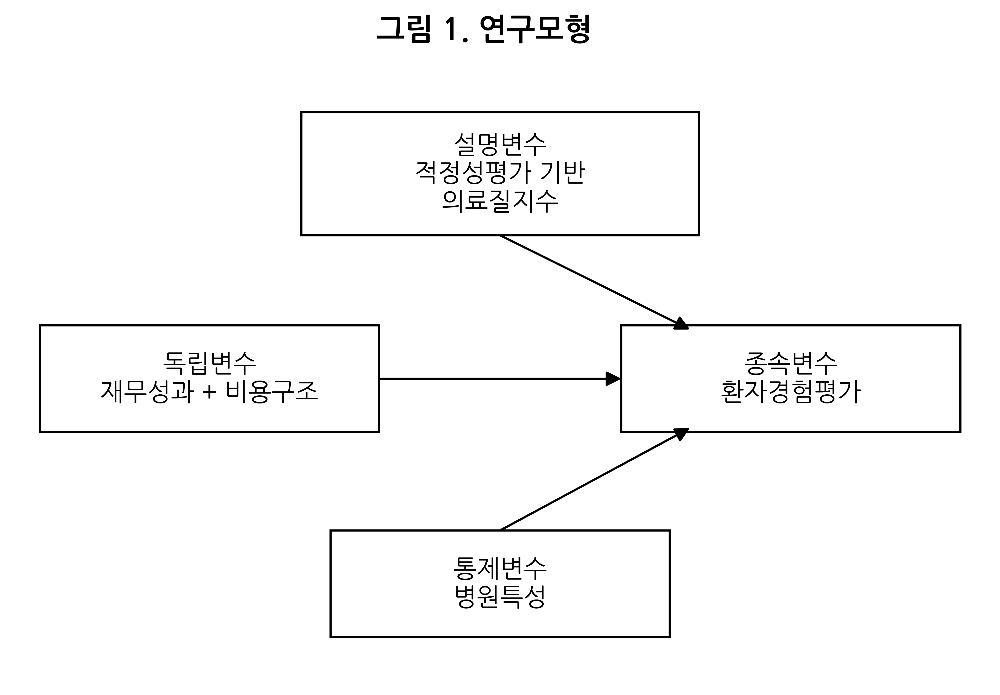
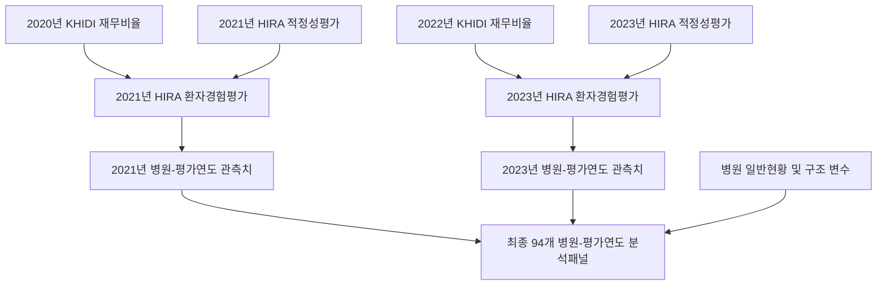
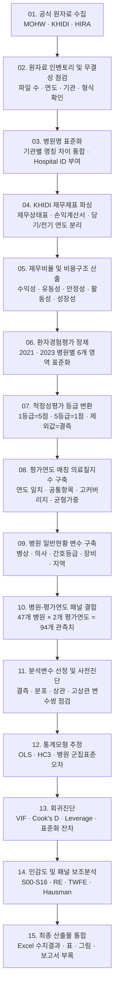
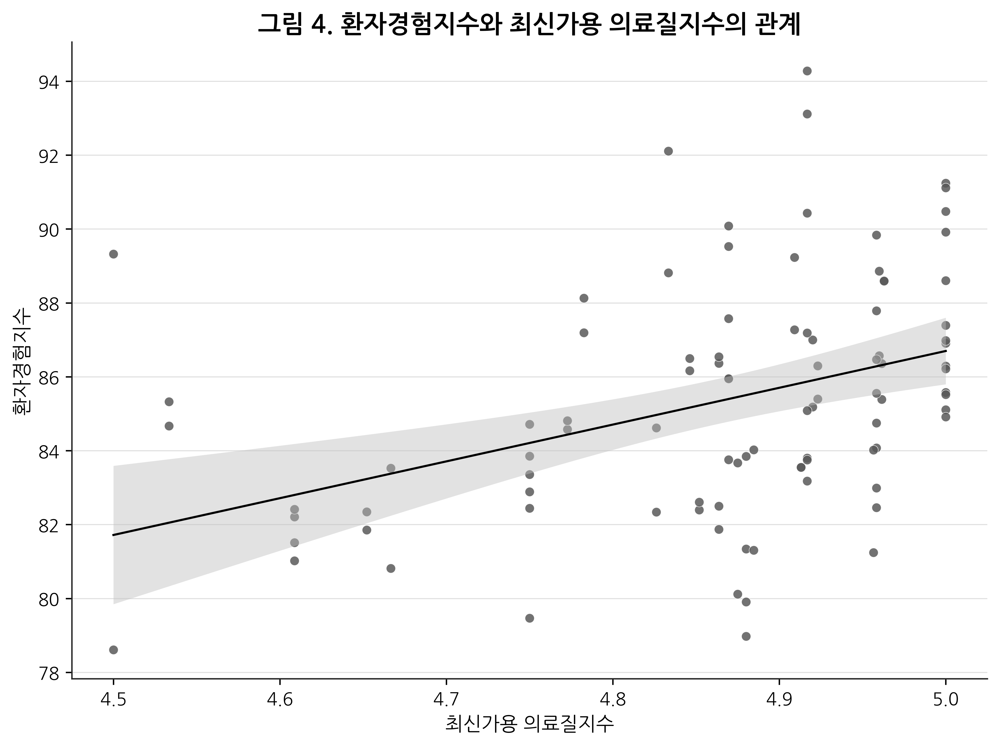

<div align="center">

# SH Hospital Management Analysis

### 상급종합병원의 환자경험평가 결정요인 분석
**재무비율 · 비용구조 · 적정성평가 · 병원특성을 결합한 병원경영분석 프로젝트**

[](./Python)
[](./R)
[](./Excel)
[](#1-프로젝트-개요)
[](#1-프로젝트-개요)
[](./LICENSE.md)

**Research Authors:** JW, LEE 
**Repository Owner & Contact:** JW, LEE  
**Course Project:** 병원경영분석, 2026년 1학기

</div>

---

## Project Summary

이 저장소는 보건복지부 지정 제5기 상급종합병원 47개소를 대상으로, 병원 단위의 **환자경험평가**, **재무성과와 비용구조**, **건강보험심사평가원 적정성평가**, **병원 규모·인력·장비·지역 특성**을 결합한 병원경영분석 프로젝트다.

연구의 중심 질문은 다음과 같다.

> 상급종합병원의 환자경험평가는 재무성과 및 비용구조와 어떤 관련성을 보이며, 적정성평가 기반 의료질지수와 병원특성을 함께 고려할 때 그 관련성은 어떻게 달라지는가?

단순 재무비율 비교에 그치지 않고, 기관별로 상이한 파일 구조와 병원명을 표준화한 뒤 병원-환자경험평가연도 단위 분석자료를 구축하였다. 이후 기술통계, 상관분석, 다중회귀분석, 강건표준오차, 군집표준오차, 회귀진단, 민감도 분석 및 패널모형을 단계적으로 적용하였다.

> [!IMPORTANT]
> 본 연구는 병원 수준 공개자료를 이용한 **통계적 관련성 분석**이다. 회귀계수는 인과효과, 의료행위의 효과 또는 특정 병원의 우열을 의미하지 않는다.

<p align="center">
  
</p>

---

## Contents

1. [프로젝트 개요](#1-프로젝트-개요)
2. [연구자료와 분석단위](#2-연구자료와-분석단위)
3. [세로형 데이터 파이프라인](#3-세로형-데이터-파이프라인)
4. [단계별 데이터 계보](#4-단계별-데이터-계보)
5. [변수 생성 및 데이터 처리 로직](#5-변수-생성-및-데이터-처리-로직)
6. [통계 분석 방법](#6-통계-분석-방법)
7. [민감도 분석과 패널모형](#7-민감도-분석과-패널모형)
8. [기술 환경과 코드 버전 체계](#8-기술-환경과-코드-버전-체계)
9. [저장소 구조](#9-저장소-구조)
10. [주요 산출물](#10-주요-산출물)
11. [핵심 분석결과의 해석 범위](#11-핵심-분석결과의-해석-범위)
12. [데이터 거버넌스](#12-데이터-거버넌스)
13. [문의 및 자료 공유 요청](#13-문의-및-자료-공유-요청)
14. [License](#14-license)

---

## 1. 프로젝트 개요

| 구분 | 내용 |
|---|---|
| 연구주제 | 상급종합병원의 환자경험평가 결정요인 분석: 재무비율과 병원특성을 중심으로 |
| 분석대상 | 보건복지부 제5기 상급종합병원 47개소 |
| 분석단위 | 병원 × 환자경험평가 연도 |
| 환자경험평가 | 2021년 3차, 2023년 4차 |
| 최종 분석 관측치 | 47개 병원 × 2개 평가연도 = 94개 |
| 재무자료 기간 | 2020~2024년 |
| 주 종속변수 | 환자경험평가 6개 영역의 동일가중 평균지수 |
| 주 재무성과 변수 | 의료수익의료이익률 |
| 주 비용구조 변수 | 인건비율 |
| 주 의료질 변수 | 평가연도 매칭 적정성평가 기반 의료질지수 |
| 주요 통제변수 | 로그 병상수, 100병상당 의사수, 간호등급, 100병상당 의료장비수, 수도권 여부, 평가연도 더미 |
| 기준 추정법 | OLS 회귀계수 + 병원 단위 군집표준오차 |
| 보조 추론 | 일반 OLS 표준오차, HC3 강건표준오차 |
| 회귀진단 | VIF, Cook’s distance, leverage, 표준화 잔차 |
| 패널 보조분석 | Random Effects, Two-Way Fixed Effects, Hausman 검정 |

### 연구모형

기준 통합모형은 다음과 같다.

$$
PatientExperience_{it}
= \beta_0
+ \beta_1 FinancialPerformance_{i,t-1}
+ \beta_2 CostStructure_{i,t-1}
+ \beta_3 Quality_{it}
+ \beta_4 HospitalCharacteristics_i
+ \gamma_t
+ \varepsilon_{it}
$$

- $i$: 병원
- $t$: 환자경험평가 연도(2021, 2023)
- $FinancialPerformance_{i,t-1}$: 환자경험평가 직전 연도 재무성과
- $CostStructure_{i,t-1}$: 환자경험평가 직전 연도 비용구조
- $Quality_{it}$: 환자경험평가와 동일 평가연도에 매칭한 적정성평가 기반 의료질지수
- $HospitalCharacteristics_i$: 병원 규모·인력·장비·지역 특성
- $\gamma_t$: 2023년 평가연도 더미

---

## 2. 연구자료와 분석단위

### 2.1 공식 자료원

| 자료영역 | 기관 | 사용 자료 | 분석 내 역할 |
|---|---|---|---|
| 지정기관 명단 | 보건복지부(MOHW) | 제5기 상급종합병원 지정기관 명단 | 47개 병원 모집단과 병원 ID 기준 |
| 재무자료 | 한국보건산업진흥원(KHIDI) | 의료기관 회계공시 재무상태표·손익계산서 | 재무성과·비용구조·유동성·안정성·활동성·성장성 지표 |
| 환자경험평가 | 건강보험심사평가원(HIRA) | 2021년·2023년 환자경험평가 | 주 종속변수와 6개 하위 종속변수 |
| 적정성평가 | 건강보험심사평가원(HIRA) | 2021년·2023년 세부 적정성평가 | 평가연도 매칭 의료질지수와 대체지수 |
| 병원 일반현황 | 건강보험심사평가원(HIRA) | 병상·의사·간호등급·의료장비·지역 | 병원특성 통제변수 |

### 2.2 자료 규모

- KHIDI 재무 원자료: **47개 병원 × 5개 연도 × 2개 재무제표 = 470개 파일**
- 환자경험평가: **47개 병원 × 2개 평가연도 = 94개 병원-연도 관측치**
- 적정성평가: 평가연도별 30개 후보항목 검토
- 적정성평가 공통항목: 94개 관측치 모두에서 유효한 12개 항목
- 적정성평가 고커버리지 항목: 90개 이상 관측치에서 유효한 20개 항목
- 최종 기준 회귀분석 자료: **94개 관측치, 47개 병원 군집**

### 2.3 시간축 정렬

주 분석에서는 환자경험평가 이후의 재무정보가 설명변수로 포함되는 역방향 시점 혼입을 줄이기 위해 직전 회계연도 재무비율을 사용하였다.



민감도 분석에서는 동일연도 재무자료, 평가연도와 직전연도의 2개년 평균, 2020~2024년 장기평균 재무자료를 별도 사양으로 비교하였다.

---

## 3. 세로형 데이터 파이프라인

아래 파이프라인은 자료수집부터 최종 통계산출물까지의 전체 흐름을 세로 방향으로 나타낸다.



### 파이프라인 설계 원칙

- 병원명 표준화표를 단일 식별 기준으로 사용하여 MOHW·KHIDI·HIRA 간 병합 오류를 줄였다.
- 재무자료, 환자경험평가, 적정성평가 및 병원특성을 한 번에 병합하지 않고 각 자료영역을 독립적으로 검수하였다.
- 평가연도와 재무연도, 적정성평가 연도를 별도 변수로 유지하여 시간축 혼입을 점검하였다.
- 영향점은 자동 삭제하지 않고 원자료 오류 여부를 먼저 확인한 뒤 제외 전후 민감도 분석으로 처리하였다.
- 최종 보고서 수치와 코드 산출물 사이의 추적 가능성을 유지하기 위해 중간 workbook을 보존하였다.

---

## 4. 단계별 데이터 계보

| 단계 | 핵심 산출물 | 기술적 목적 |
|---:|---|---|
| 0차 | `0차_원자료검수_병원명표준화표.xlsx` | 파일 인벤토리, 기관명 표준화, 병원 ID, 자료원별 완전성 점검 |
| 1차 | `1차_KHIDI_재무원자료_파싱결과.xlsx` | KHIDI 계정 파싱, 당기·전기 분리, 병원-연도 재무 테이블 구축 |
| 2차 | `2차_재무비율_산출결과.xlsx` | 수익성·비용구조·유동성·안정성·활동성·성장성 지표 계산 |
| 3차 | `3차_환자경험평가_정리결과.xlsx` | 6개 환자경험 영역 정제, 병원명 매칭, 이상값 및 단위 오류 수정 |
| 4차 | `4차_적정성평가_등급자료_정리결과.xlsx` | 적정성평가 wide-to-long 변환, 등급 점수화, 제외값 결측 처리 |
| 5차 | `5차_병원일반현황_병원특성_정리결과.xlsx` | 병상·인력·간호등급·장비·지역 변수 구축 |
| 6차 | `6차_analysis_master_dataset_rebuilt.xlsx` | 병원-평가연도 통합패널, 분석키, 변수사전 구축 |
| 7차 | `7차_적정성평가_gap_year_매칭결과.xlsx` | 평가연도 간격, 시점 후보, 보수적·최신가용 매칭 검토 |
| 8차 | `8차_기술통계_상관분석_준비데이터셋.xlsx` | 결측, 변수 분포, 기술통계 및 상관분석 입력자료 |
| 9차 | `9차_기술통계_상관분석_회귀분석_투입변수_최종선정.xlsx` | 고상관 구조 점검, 최종 회귀투입 변수와 모형 사양 확정 |
| 10차 | `10차_회귀분석_회귀진단.xlsx` | OLS·HC3·군집표준오차, VIF, Cook’s distance, leverage, 영역별 분석 |
| 11차 | `11차_민감도_분석.xlsx` | 연도·재무시점·지수구성·영향점·안정성 변수 민감도 분석 |
| 12차 | `12차_분석재현패키지_구현.xlsx` | 코드-결과 매핑, 분석 모듈 정리, 수치결과 통합 점검 |
| 13차 | `13차_작성계획.xlsx` | 논문 표·그림·본문·부록 배치와 최종 작성 구조 설계 |

> [!NOTE]
> 7차 산출물은 적정성평가 시점 불일치 대안을 검토하기 위한 중간 감사자료다. 최종 보고서의 주 의료질 변수는 2021년과 2023년 세부 적정성평가를 동일 환자경험평가 연도에 연결한 `year_matched_quality_index`다.

---

## 5. 변수 생성 및 데이터 처리 로직

### 5.1 병원 식별체계

자료원마다 상이한 기관명을 공백·법인명·약칭·대학명 표기 차이를 기준으로 정규화하였다.

```text
MOHW 지정명
      ↓
HIRA 환자경험평가 등록명
      ↓
HIRA 병원 일반현황 등록명
      ↓
KHIDI 회계공시 등록명
      ↓
표준 병원명 + hospital_id_code
```

최종 병원 ID는 `H001`부터 `H047`까지의 고정 코드 체계를 사용한다.

### 5.2 환자경험지수

환자경험평가 6개 영역을 동일가중 단순평균하여 주 종속변수를 산출하였다.

1. 간호사 영역
2. 의사 영역
3. 투약 및 치료과정
4. 병원환경
5. 환자권리보장
6. 전반적 평가

$$
PatientExperienceIndex
= \frac{Nurse + Doctor + Treatment + Environment + Rights + Overall}{6}
$$

6개 영역은 각각 별도의 하위 종속변수로도 사용하였다.

### 5.3 주요 재무성과 및 비용구조 변수

| 변수 | 산식 |
|---|---|
| 의료수익의료이익률 | $Medical\ Income / Medical\ Revenue \times 100$ |
| 의료수익순이익률 | $Net\ Income / Medical\ Revenue \times 100$ |
| 총자산순이익률 | $Net\ Income / Total\ Assets \times 100$ |
| 의료비용률 | $Medical\ Cost / Medical\ Revenue \times 100$ |
| 인건비율 | $Labor\ Cost / Medical\ Revenue \times 100$ |
| 재료비율 | $Material\ Cost / Medical\ Revenue \times 100$ |
| 관리운영비율 | $Administrative\ Cost / Medical\ Revenue \times 100$ |
| 유동비율 | $Current\ Assets / Current\ Liabilities \times 100$ |
| 부채비율 | $Total\ Liabilities / Total\ Equity \times 100$ |
| 자기자본비율 | $Total\ Equity / Total\ Assets \times 100$ |
| 총자산회전율 | $Medical\ Revenue / Total\ Assets$ |
| 의료수익증가율 | 병원별 전년 대비 의료수익 증감률 |

분모가 0이거나 결측인 경우 해당 비율은 계산하지 않고 결측값으로 유지하였다.

### 5.4 부채비율의 구조적 극단값 처리

부채비율은 자본총계를 분모로 사용하므로 자본총계가 음수이거나 0에 가까운 병원-연도에서 극단값이 발생할 수 있다. 이에 따라 다음 원칙을 적용하였다.

- 주 회귀모형에서는 부채비율을 제외하였다.
- 기술통계에서는 평균과 중앙값을 병행하였다.
- 민감도 분석에서는 원자료 부채비율, 5~95% 윈저화 부채비율, 자기자본비율 대체모형을 별도로 비교하였다.
- 극단값을 단순 계산오류로 간주하지 않고 자본구조의 분모 특성으로 해석하였다.

### 5.5 적정성평가 등급 변환

등급은 다음과 같이 역점수화하였다.

$$
Score = 6 - Grade, \qquad Grade \in \{1,2,3,4,5\}
$$

| HIRA 등급 | 분석 점수 |
|---:|---:|
| 1등급 | 5점 |
| 2등급 | 4점 |
| 3등급 | 3점 |
| 4등급 | 2점 |
| 5등급 | 1점 |
| 평가대상제외 | 결측값 |
| 등급제외 | 결측값 |

`평가대상제외`와 `등급제외`는 낮은 의료질을 의미하지 않으므로 0점으로 처리하지 않았다.

### 5.6 평가연도 매칭 의료질지수

병원 $i$, 평가연도 $t$에서 유효 등급이 존재하는 항목만 평균하였다.

$$
QualityIndex_{it}
= \frac{1}{K_{it}}\sum_{k=1}^{K_{it}} Score_{ikt}
$$

- $K_{it}$: 병원-평가연도별 유효 평가항목 수
- 2021년 환자경험평가: 2021년 적정성평가 세부자료 매칭
- 2023년 환자경험평가: 2023년 적정성평가 세부자료 매칭

### 5.7 의료질지수 대체 사양

| 변수명 | 구성 방식 |
|---|---|
| `year_matched_quality_index` | 환자경험평가와 동일한 평가연도의 유효 적정성평가 항목 평균 |
| `latest_quality_index` | 항목별 최신가용 등급 평균 |
| `year_matched_valid_item_count` | 병원-평가연도별 유효 평가항목 수 |
| `year_matched_top_grade_count` | 유효 항목 중 1등급 항목 수 |
| `year_matched_top_grade_rate` | 유효 항목 중 1등급 항목 비율 |
| `year_matched_common12_index` | 94개 관측치 모두에서 유효한 12개 공통항목 평균 |
| `year_matched_high20_index` | 90개 이상 관측치에서 유효한 20개 고커버리지 항목 평균 |
| `year_matched_balanced_category_index` | 대분류별 평균을 먼저 산출한 뒤 대분류 평균을 재평균 |

### 5.8 병원특성 변수 표준화

- 병원 규모: `log_total_beds = log(total_beds)`
- 의료인력: `doctors_per_100_beds = total_doctors / total_beds × 100`
- 장비집약도: `equipment_per_100_beds = equipment_total / total_beds × 100`
- 간호등급: 건강보험 기준 주 간호등급 숫자
- 지역: 수도권 1, 비수도권 0
- 평가연도: 2023년 1, 2021년 0

총병상수·총의사수·총장비수를 같은 모형에 직접 투입하지 않고 로그 규모변수와 100병상당 지표를 사용하여 규모효과와 다중공선성 위험을 줄였다.

---

## 6. 통계 분석 방법

### 6.1 기술통계

- 관측치 수
- 평균
- 표준편차
- 중앙값
- 최소값
- 최대값
- 평가연도별 분포
- 병원특성 범주별 빈도 및 비율

부채비율처럼 분포 왜도가 큰 변수는 평균만으로 대표하지 않고 중앙값과 자본잠식·음의 자본 관측치 수를 병행하였다.

### 6.2 상관분석

- Pearson 상관계수
- Spearman 순위상관계수
- 환자경험평가 6개 영역 간 상관구조
- 환자경험지수와 주요 설명변수의 단순 관련성
- 설명변수 간 고상관 변수쌍 탐지

상관분석은 회귀모형 변수 선택과 다중공선성 사전진단에 사용하였다. 상관계수만으로 독립적 관련성이나 인과성을 판단하지 않았다.

### 6.3 단계별 회귀모형

| 모형 | 분석 사양 |
|---|---|
| M0 | 평가연도 더미만 포함한 기초모형 |
| M1a | 의료수익의료이익률 + 평가연도 더미 |
| M1b | 의료수익순이익률 + 평가연도 더미 |
| M1c | 총자산순이익률 + 평가연도 더미 |
| M2 | 인건비율 + 재료비율 + 관리운영비율 + 평가연도 더미 |
| M3a | 평가연도 매칭 의료질지수 + 평가연도 더미 |
| M3b | 최신가용 의료질지수 + 평가연도 더미 |
| M4 | 재무성과 + 병원특성 통제 |
| M5 | 재무성과 + 비용구조 + 의료질지수 + 병원특성 + 평가연도 더미 |

### 6.4 기준 통합모형 M5

M5에는 다음 변수를 투입하였다.

- 의료수익의료이익률
- 인건비율
- 평가연도 매칭 의료질지수
- 로그 병상수
- 100병상당 의사수
- 간호등급
- 100병상당 의료장비수
- 수도권 여부
- 2023년 평가연도 더미

### 6.5 표준오차 처리

동일 병원이 2021년과 2023년에 반복 관측되므로 병원 내부 오차상관 가능성을 고려하였다.

| 방식 | 역할 |
|---|---|
| 일반 OLS 표준오차 | 기준 회귀출력과의 비교 |
| HC3 강건표준오차 | 이분산과 제한된 표본에 대한 보조 추론 |
| 병원 단위 군집표준오차 | 동일 병원의 반복관측으로 인한 병원 내 오차상관 보정 |

주 해석은 병원 단위 군집표준오차를 기준으로 수행하였다. HC3와 일반 OLS 결과는 통계적 유의성이 표준오차 처리 방식에 민감한지 확인하는 비교자료로 사용하였다.

### 6.6 회귀진단

| 진단 | 목적 |
|---|---|
| VIF | 설명변수 간 다중공선성 확인 |
| Cook’s distance | 특정 관측치가 회귀계수에 미치는 영향 확인 |
| Leverage | 설명변수 공간에서 고레버리지 관측치 탐지 |
| 표준화 잔차 | 종속변수 방향의 큰 잔차 관측치 탐지 |
| 표준화 회귀계수 | 변수 단위 차이를 제거한 상대적 관련성 비교 |

진단 기준은 다음과 같다.

$$
CookThreshold = \frac{4}{n}
$$

$$
LeverageThreshold = \frac{2k}{n}
$$

- $n$: 분석 관측치 수
- $k$: 상수항을 포함한 추정 모수 수

영향점 후보는 삭제하지 않았다. 원자료 오류 여부를 검토한 뒤 전체 표본을 기준 분석으로 유지하고, 영향점 제외모형을 민감도 분석으로 제시하였다.

### 6.7 환자경험 6개 영역별 보조분석

다음 영역을 각각 종속변수로 하는 동일 사양의 보조 회귀모형을 추정하였다.

- 간호사 영역
- 의사 영역
- 투약 및 치료과정
- 병원환경
- 환자권리보장
- 전반적 평가

영역별 결과는 종합 환자경험지수의 분석을 보완하기 위한 결과이며, 다중비교와 제한된 관측치 수를 고려하여 보조적으로 해석하였다.

---

## 7. 민감도 분석과 패널모형

### 7.1 민감도 분석 사양

| ID | 분석 내용 |
|---|---|
| S00 | 기준 통합모형 |
| S01 | 2021년 단면분석 |
| S02 | 2023년 단면분석 |
| S03 | 동일연도 재무자료 모형 |
| S04 | 평가연도 및 직전연도 2개년 평균 재무자료 모형 |
| S05 | 2020~2024년 평균 재무자료 모형 |
| S06 | 최신가용 의료질지수 보조모형 |
| S08 | Cook’s distance 기준 영향점 제외모형 |
| S09 | 유효 평가항목 수 추가 통제모형 |
| S10 | 공통 12개 항목 제한 의료질지수 모형 |
| S11 | 고커버리지 20개 항목 제한 의료질지수 모형 |
| S12 | 대분류 균형가중 의료질지수 모형 |
| S13 | 원자료 부채비율 추가모형 |
| S14 | 5~95% 윈저화 부채비율 추가모형 |
| S15 | 자기자본비율 대체모형 |
| S16 | 분모 점검 정상표본 제한모형 |

민감도 분석은 다음 위험을 검토하기 위해 설계하였다.

- 특정 평가연도에만 의존하는 결과인지 여부
- 재무자료 매칭시점 변경에 따른 계수 변동
- 적정성평가 지수 구성 방식에 따른 결과 변동
- 영향점 후보 관측치가 전체 결과를 주도하는지 여부
- 부채비율의 분모구조와 극단값에 따른 추정 불안정성

### 7.2 패널 보조모형

병원-평가연도 반복관측 구조를 활용하여 다음 모형을 추가로 추정하였다.

1. Pooled OLS
2. Random Effects
3. Two-Way Fixed Effects
4. Hausman specification test

Two-Way Fixed Effects는 병원 고정효과와 평가연도 고정효과를 동시에 통제한다. 그러나 본 자료는 2021년과 2023년의 2개 시점만 포함하므로, 병원 내부의 장기변화를 충분히 식별하는 주 분석이 아니라 기준모형의 해석 범위를 점검하는 보조분석으로 사용하였다.

Hausman 검정은 Random Effects와 Two-Way Fixed Effects에서 공통으로 추정된 핵심 변수의 계수 차이를 비교하였다.

---

## 8. 기술 환경과 코드 버전 체계

### 8.1 확인된 작업 환경

| 영역 | 사용 기술 |
|---|---|
| 통합 개발환경 | Visual Studio Code |
| 데이터 정리 | Python, Microsoft Excel |
| 통계분석 | R |
| 검수 및 단계별 감사 | Microsoft Excel workbook |
| 시각화 | Python Matplotlib, R ggplot2 |
| 주요 입력 형식 | ZIP, XLSX, XLS, CSV, SAV, RDS |
| 주요 출력 형식 | XLSX, CSV, PNG, JPG, Markdown |
| 저장소 기본 브랜치 | `main` |

> [!NOTE]
> 현재 저장소에는 운영체제 버전, Python 정확한 버전, R 정확한 버전, 패키지 lockfile이 고정되어 있지 않다. 따라서 확인되지 않은 버전 번호는 임의로 기재하지 않았다.

### 8.2 Python 코드 계층

| 파일 | 역할 | 상태 |
|---|---|---|
| `Python/00_local_paths.py` | 프로젝트 경로, 원자료·중간산출물·결과 경로, 변수명 중앙설정 | Canonical configuration |
| `Python/01_raw_to_nth_excels.py` | 원자료 ZIP 인벤토리, 병원 master table, 보수적 stage 생성 | Canonical preprocessing |
| `Python/02_year_matched_quality_index.py` | 2021·2023 적정성평가 등급 변환과 평가연도 매칭 의료질지수 산출 | Canonical quality-index module |
| `Python/03_numeric_results_export.py` | 최종 수치결과 workbook 통합과 시트 스타일링 | Canonical output module |
| `Python/04_make_monochrome_figures.py` | 최종 수치결과 workbook 기반 논문용 그림 생성 | Canonical visualization module |

### 8.3 R 코드 계층

| 파일 | 역할 | 상태 |
|---|---|---|
| `R/00_local_paths.R` | R 분석 경로 및 핵심 변수명 중앙설정 | Canonical configuration |
| `R/01_regression_robust_diagnostics.R` | OLS, HC3, 병원 군집표준오차, VIF, 영향점 진단 | Canonical regression module |
| `R/02_sensitivity_and_panel_models.R` | 민감도 분석, Random Effects, Two-Way Fixed Effects, Hausman 검정 | Canonical robustness module |
| `R/03_make_monochrome_figures.R` | R 기반 논문용 단색 시각화 | Canonical visualization module |
| `R/R_packages.txt` | 확인된 R 패키지 목록 | Dependency inventory |

### 8.4 주요 패키지

#### Python

- `pandas`
- `numpy`
- `openpyxl`
- `matplotlib`
- `xlrd`

#### R

- `readxl`
- `dplyr`
- `tidyr`
- `stringr`
- `purrr`
- `writexl`
- `sandwich`
- `lmtest`
- `car`
- `plm`
- `broom`
- `ggplot2`


### 8.5 코드 버전 관리 방식

이 저장소는 단일 semantic version보다 **파일 단계와 역할 중심 버전관리**를 사용한다.

| 계층 | 버전 식별 방식 |
|---|---|
| 초기 KHIDI 파서 | 루트 파일명 `v1` → `v4` |
| Canonical Python | `00` → `04` 실행·역할 순서 |
| Canonical R | `00` → `03` 실행·역할 순서 |
| 중간 분석자료 | `0차` → `13차` 데이터 계보 |
| 민감도 분석 | `S00` → `S16` 모형 ID |

### 8.6 Canonical 코드와 Legacy 코드

| 구분 | 경로 | 사용 원칙 |
|---|---|---|
| Canonical Python | `Python/` | 현재 구조와 변수명을 반영한 주 데이터 처리 코드 |
| Canonical R | `R/` | 회귀분석, 강건추론, 회귀진단, 민감도 및 패널분석 코드 |
| Canonical numeric output | `Excel/hospital_management_full_numeric_results.xlsx` | 최종 보고서 수치와 분석결과 확인의 기준 workbook |
| Canonical figures | `figure_img/` | 최종 보고서에 반영된 시각화 |
| Legacy / audit trail | 저장소 루트의 `01_...`~`09_...` | 개발 과정의 파싱 실험, 초기 버전 및 검산 기록 |

> [!WARNING]
> 저장소 루트의 일부 초기 코드는 개인 로컬 경로, 초기 병원 수 설정 또는 시험용 출력구조가 남아 있을 수 있다. 현재 기술 구조의 기준은 `Python/`과 `R/`의 canonical 모듈이다.

---

## 9. 저장소 구조

```text
SH-Hospital_Management_Analysis/
├─ README.md
├─ LICENSE.md
├─ pipeline_overview.md
├─ Python/
│  ├─ 00_local_paths.py
│  ├─ 01_raw_to_nth_excels.py
│  ├─ 02_year_matched_quality_index.py
│  ├─ 03_numeric_results_export.py
│  └─ 04_make_monochrome_figures.py
├─ R/
│  ├─ 00_local_paths.R
│  ├─ 01_regression_robust_diagnostics.R
│  ├─ 02_sensitivity_and_panel_models.R
│  ├─ 03_make_monochrome_figures.R
│  └─ R_packages.txt
├─ Excel/
│  ├─ hospital_management_full_numeric_results.xlsx
│  └─ 원자료/
├─ figure_img/
│  ├─ figure_01_research_model_simple.png
│  ├─ figure_02_patient_experience_domain_boxplot.png
│  ├─ figure_03_financial_ratios_trend.png
│  ├─ figure_04_quality_vs_patient_experience_scatter.png
│  ├─ figure_05_m5_standardized_coefficient_plot.png
│  ├─ figure_06_sensitivity_quality_coefficient_plot.png
│  ├─ appendix_figure_A_correlation_heatmap.png
│  └─ appendix_figure_B_cooks_distance.png
├─ 본문 첨부 이미지/
└─ 01~09 root-level legacy scripts
```

---

## 10. 주요 산출물

### 10.1 최종 수치결과 workbook

[`Excel/hospital_management_full_numeric_results.xlsx`](Excel/hospital_management_full_numeric_results.xlsx)

주요 포함 항목은 다음과 같다.

- 병원-평가연도 분석패널
- 변수명 대응표
- 환자경험평가 기술통계
- 재무비율 및 비용구조 기술통계
- 적정성평가 항목 커버리지
- Pearson 및 Spearman 상관분석
- M0~M5 회귀모형 결과
- OLS·HC3·병원 군집표준오차 비교
- 표준화 회귀계수
- VIF
- Cook’s distance
- leverage
- 표준화 잔차
- 환자경험 6개 영역별 보조모형
- S00~S16 민감도 분석
- Random Effects
- Two-Way Fixed Effects
- Hausman 검정

### 10.2 시각화

- 생략

### 10.3 결과와 분석모듈의 대응

| 산출물 | 연결 모듈 |
|---|---|
| 재무비율 및 비용구조 결과 | KHIDI 파싱 코드, 1차·2차 workbook |
| 환자경험평가 결과 | 3차 workbook, 최종 분석패널 |
| 평가연도 매칭 의료질지수 | `Python/02_year_matched_quality_index.py`, 4차·7차 workbook |
| OLS·HC3·군집표준오차 | `R/01_regression_robust_diagnostics.R` |
| VIF·Cook’s D·Leverage | `R/01_regression_robust_diagnostics.R` |
| 민감도·RE·TWFE·Hausman | `R/02_sensitivity_and_panel_models.R` |

---

## 11. 핵심 분석결과의 해석 범위

이 저장소는 분석방법과 기술 구조를 중심으로 설명하며, 상세 수치는 최종 보고서와 통합 workbook을 기준으로 한다.

- 의료수익의료이익률은 단순 재무성과 모형에서 환자경험지수와 양의 관련성을 보였으나, 의료질지수와 병원특성을 함께 포함한 기준 통합모형에서는 독립적 관련성이 유지되지 않았다.
- 인건비율은 일부 단순모형과 민감도 분석에서 음의 방향을 보였으나, 기준 통합모형의 병원 단위 군집표준오차 기준에서는 확정적인 관련성이 확인되지 않았다.
- 평가연도 매칭 의료질지수는 기준 통합모형, 연도별 단면분석, 재무시점 변경, 지수구성 변경 및 영향점 제외 분석에서 일관된 양의 관련성을 보였다.
- Random Effects에서는 의료질지수의 양의 관련성이 유지되었으나, Two-Way Fixed Effects에서는 통계적 유의성이 확인되지 않았다.
- 따라서 핵심 결과는 동일 병원 내부의 단기 변화효과가 아니라, **병원 간 적정성평가 수준과 환자경험평가 간 통계적 관련성**으로 제한하여 해석한다.

<p align="center">
  
</p>

---

## 12. 데이터 거버넌스

### 12.1 공개자료 사용범위

- 분석은 공식기관이 공개한 병원 수준 자료를 기반으로 한다.
- 환자 개인 단위 기록, 주민등록정보, 개인 진료기록 및 개인식별정보는 포함하지 않는다.
- 환자경험평가는 HIRA가 공개한 병원별 집계점수를 사용한다.
- 병원명은 공식자료 간 매칭을 위한 공개 기관 식별정보다.

### 12.2 저장소와 외부 보관자료의 구분

원자료, 단계별 검수 workbook, 보고서 버전, 세부 재현성 패키지 및 협업기록은 별도의 접근통제형 저장공간에서 관리한다. GitHub 저장소에 공개된 파일만으로 외부 사용자가 전체 분석자료 또는 모든 원자료에 접근할 수 있는 구조가 아니다.

> [!CAUTION]
> 외부 저장공간에는 원자료, 중간 검수본, 협업기록 및 버전 이력이 함께 존재할 수 있으므로 공개 링크를 README에 직접 제공하지 않는다. 자료 공유는 아래의 공식 요청 양식과 개별 서면승인을 거쳐야 한다.

### 12.3 이용상 유의사항

- 공식기관 원자료의 이용조건과 재배포 정책은 각 원자료 제공기관의 조건이 우선한다.
- 본 분석결과를 병원 순위화, 평판평가, 광고, 영업 또는 투자판단의 단독 근거로 사용할 수 없다.
- 연구결과와 코드의 공개 열람은 사용·복제·수정·배포 허가를 의미하지 않는다.
- 저장소의 코드, 정제자료, 분석결과, 도표 및 문서에 대한 권리는 아래 License 조항을 따른다.

---

## 13. 문의 및 자료 공유 요청

프로젝트 관련 문의, 분석방법 자문, 코드 사용 협의, 비공개 자료 열람 또는 자료 공유가 필요한 경우 아래 양식에 따라 이메일을 작성해야 한다.

**Contact Email:**  

> console.log.mern@gamil.com

### 13.1 권장 이메일 제목

```text
[SH-Hospital Management Analysis] OOOO요청 - 성명 - 소속기관
```

### 13.2 필수 기재사항

1. **성명**
2. **소속기관·학과·부서**
3. **직위 또는 신분**
4. **개인 전화번호**
5. **개인 이메일 주소**
6. **현재 연구하고 있는 내용**
7. **요청 또는 자문받고자 하는 내용**
8. **필요한 자료·코드·변수·분석결과의 구체적 범위**
9. **자료 사용 목적**
10. **예정된 연구방법 또는 분석계획**
11. **예정 산출물**: 논문, 학위논문, 보고서, 발표, 교육자료, 서비스, 상업적 결과물 등
12. **자료 보관 방식과 보안계획**
13. **제3자 제공 또는 공동연구자 공유 여부**
14. **공개·출판·배포 계획**
15. **필요 시점 또는 회신 희망일**
16. **본 저장소 License 및 이용제한 확인 여부**
17. **기타 이해상충 또는 사전에 고지할 사항**

### 13.3 이메일 작성 양식

```text
수신: 
제목: [SH-Hospital Management Analysis] 자료 공유·연구 자문 요청 - [성명] - [소속기관]


<필수 포함 사항>
1. 성명:
2. 소속기관·학과·부서:
3. 직위 또는 신분:
4. 개인 전화번호:
5. 개인 이메일:
6. 현재 연구하고 있는 내용:
7. 요청 또는 자문받고자 하는 내용:
8. 요청 자료·코드·변수·분석결과의 범위:
9. 자료 사용 목적:
10. 예정된 연구방법 또는 분석계획:
11. 예정 산출물과 공개·출판 계획:
12. 자료 보관 방식과 보안계획:
13. 제3자 제공 또는 공동연구자 공유 여부:
14. 회신 희망일:
15. 이해상충 또는 추가 고지사항:

[이용제한 확인]
본인은 본 저장소와 관련 자료가 오픈소스 또는 자유이용 자료가 아니며,
저장소 권리자의 명시적 서면허가 없이 복제·수정·배포·재사용·재분석·2차 저작물 작성·상업적 이용을 할 수 없음을 확인합니다.

감사합니다.
[성명]
```

### 13.4 검토 원칙

- 양식이 불완전하거나 사용 목적이 불명확한 요청은 검토하지 않습니다.
- 이메일 발송만으로 자료 이용 또는 공유가 승인되지 않습니다.
- 이용 허가는 반드시 권리자의 명시적 서면승인으로만 성립합니다.
- 자료 특성에 따라 별도의 비밀유지약정, 자료이용계약 또는 공동연구 합의가 요구될 수 있습니다.
- 자료 제공 여부, 제공 범위 및 제공 형식은 저장소 권리자가 개별적으로 결정합니다.

---

## 14. License

### Proprietary — All Rights Reserved

이 저장소는 오픈소스 프로젝트가 아닙니다. 저장소 권리자(pota****)에게 귀속되며, 코드, 정제자료, 분석결과, 표, 그림, 문서 및 저장소 구성요소에 대해서는 **어떠한 묵시적 이용허락도 부여되지 않습니다.**

관리자(pota****) 본인 또는 이정욱이 사전에 명시적으로 서면 승인한 사람을 제외하고, 다음 행위는 금지된다.

- 재배포, 재게시, 미러링, 포크를 이용한 2차 배포
- 일부 또는 전부를 이용한 2차 저작물 작성
- 논문·보고서·강의자료·발표자료·서비스·제품에의 편입
- 상업적·비상업적·교육적·연구적 목적의 재사용
- 데이터셋, 벤치마크 또는 인공지능 학습자료로의 편입
- 분석결과를 이용한 병원 순위화, 평가, 광고 또는 영업활동
- 제3자에게 코드·자료·분석결과를 제공하거나 공유하는 행위

공개 저장소에서 파일을 기술적으로 열람할 수 있다는 사실은 저작권법상 사용·복제·수정·배포 허가를 의미하지 않는다. 개별 이용허가는 [문의 및 자료 공유 요청](#13-문의-및-자료-공유-요청)의 양식에 따른 사전 요청과 명시적 서면승인을 통해서만 부여됩니다.

보건복지부, KHIDI, HIRA 및 기타 제3자가 제공한 원자료·상표·문서의 권리는 각 원권리자에게 있으며, 해당 자료의 이용조건은 원권리자의 정책이 우선됩니다. 공동저작물에 대해서는 공동저작자 및 관련 권리자의 권리가 별도로 적용될 수 있습니다.

전체 조항은 [`LICENSE.md`](./LICENSE.md)를 따른다.


---

<div align="center">

**Official hospital-level data · auditable staged workbooks · robust statistical inference · restricted use**

</div>
